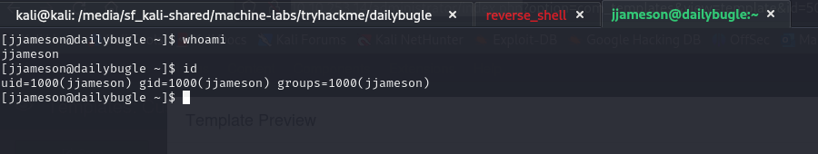

# Daily Bugle

---
source: [TryHackMe | Daily Bugle](https://tryhackme.com/r/room/dailybugle)

## Nmap scan:

We have identified three open ports on the target:

1. **22/tcp (SSH)**
    
    - Version: OpenSSH 7.4
    
2. **80/tcp (HTTP)**
    
    - Version: Apache/2.4.6 (CentOS)  PHP/5.6.40
    - CMS: Joomla!
    
1. **3306/tcp (MySQL/MariaDB)**
    
    - Version: MariaDB (unauthorized access).

---
## Web page exploration

We know that there is probably a web page on port 80, so let's see what that is.

Perfect! We already have the first flag:

---
## CMS Joomla

We know that it uses the Joomla CMS, so let's do a scan with **joomscan** to find out more information.

Here we have the second flag! The Joomla version.

We also discovered some interesting directories such as the CMS login page.
Now that we have the CMS version, let's look for any known vulnerabilities.

Great! We know that this version is vulnerable to SQLi!

Initially I tried with sqlmap to exploit the vulnerability but it took a really long time, then I tried to follow the advice of the author of the machine, I looked for a script in python:

It looks interesting, let's try it:

BOOM! In a moment we have the username, email and password of a user who seems to have Super User permissions.

Too bad the password is hashed, but no worries, the hash seems to be **bcrypt**, so let's try to solve it right away:

Bingo! We have the password for jonah!

---

If you remember correctly we had port 22 open, let's try to access immediately with the credentials found:

Unfortunately we had no luck, so let's try to access the site's control panel with these credentials:

Great, we logged in with an administrator account!

---
## Reverse Shell

While I was looking for something useful in the control panel, I noticed that
in the Templates section there are some php files that can be modified.

So let's create a reverse shell in php and insert it in place of index.php:

Next we open a new terminal session and listen on the shell port:

Now by saving the file and going to Template Preview we will get a shell!

---

## Privilege Escalation

Now we can see that we are logged in as apache, going to /home we can see instead that there is a user called jjameson.

After a few minutes of searching I found a clear text password in a php configuration file:

Let's go and try if this could be the password for jjameson:

Perfect! Now we can retrieve the first flag:

---

## Root

Interesting! If we search on **gtfobins** we see that we can exploit the binary to spawn a shell with root permissions:

IT WORKS! Let's go capture our last flag!

